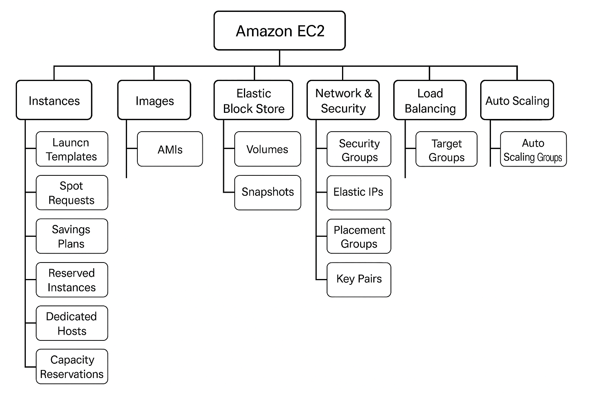

1.  Q: What is Amazon EC2?   
    A:  Amazon EC2 is a web service that provides resizable compute capacity in the cloud, allowing users to run virtual servers known as instances.

2.  Q: What is an EC2 instance?   
    A:  An EC2 instance is a virtual server in Amazon’s Elastic Compute Cloud (EC2) for running applications on the AWS infrastructure.

3.  Q: What are EC2 instance types?   
    A:  Instance types are combinations of CPU, memory, storage, and networking capacity designed to suit different use cases (e.g., General Purpose, Compute Optimized, Memory Optimized).

4.  Q: What is an AMI?   
    A:  AMI (Amazon Machine Image) is a pre-configured template that contains the software configuration (OS, application server, applications) to launch an instance.

5.  Q: What is the difference between EBS and instance store?   
    A:  EBS (Elastic Block Store) is persistent storage, while instance store is temporary and data is lost when the instance stops or terminates.

6.  Q: What are EC2 pricing options?   
    A:  On-Demand, Reserved, Spot, and Savings Plans.

7.  Q: What is a key pair in EC2?   
    A:  A key pair is used to securely access EC2 instances. It consists of a public key (stored by AWS) and a private key (stored by the user).

8.  Q: What is user data in EC2?   
    A:  User data is a script that is run automatically when an EC2 instance starts, often used for bootstrapping.

9.  Q: What is the default root volume size for Amazon Linux 2 AMI?   
    A:  8 GB.

10.  Q: Can we stop a Spot instance?   
     A:  No, Spot instances can be terminated by AWS when the capacity is no longer available or price exceeds the bid.

11.  Q: What is EC2 Auto Scaling?   
     A:  Auto Scaling automatically adjusts the number of EC2 instances in a group based on demand.

12.  Q: What is a Security Group?   
     A:  A virtual firewall that controls inbound and outbound traffic for EC2 instances.

13.  Q: What is the use of Elastic IP?   
     A:  It is a static, public IPv4 address designed for dynamic cloud computing, allowing consistent access to an instance.

14.  Q: What is a Placement Group?   
     A:  A placement strategy that determines how instances are placed on underlying hardware for better performance.

15.  Q: Can you attach multiple EBS volumes to one EC2 instance?   
     A:  Yes.

16.  Q: What is the maximum number of security groups per network interface?   
     A:  5 by default (can be increased).

17.  Q: What happens when you reboot an EC2 instance?   
     A:  It retains its instance ID and attached volumes. The reboot is like restarting a physical machine.

18.  Q: What happens when an EC2 instance is terminated?   
     A:  The instance is permanently deleted and associated ephemeral storage is lost unless EBS volumes are preserved.

19.  Q: What is EC2 Hibernate?   
     A:  Hibernate saves the in-memory RAM to EBS and resumes the instance to its previous state on restart.

20.  Q: What are Dedicated Hosts?   
     A:  Physical servers fully dedicated to your use to meet compliance or licensing requirements.

21.  Q: What is an Elastic Load Balancer (ELB)?   
     A:  It automatically distributes incoming application traffic across multiple EC2 instances.

22.  Q: Can we resize an EC2 instance?   
     A:  Yes, by stopping the instance and changing its type.

23.  Q: What are instance metadata and user data used for?   
     A:  Instance metadata provides information about the instance, and user data is used to automate configuration tasks.

24.  Q: What is the difference between Public IP and Elastic IP?   
     A:  Public IP is dynamically assigned and lost when the instance stops; Elastic IP is static.

25.  Q: What is the default EC2 instance limit per region?   
     A:  20 On-Demand instances per region by default (can be increased).

26.  Q: What are tags in EC2?   
     A:  Key-value pairs assigned to instances for categorization and management.

27.  Q: Can we assign multiple IPs to an EC2 instance?   
     A:  Yes, by assigning secondary private IP addresses to the network interface.

28.  Q: What is the difference between stopping and terminating an EC2 instance?   
     A:  Stopping keeps the instance and its root volume; terminating deletes them (unless configured otherwise).

29.  Q: Can an EC2 instance have multiple network interfaces?   
     A:  Yes, using Elastic Network Interfaces (ENIs).

30.  Q: What is EC2 Instance Store-backed and EBS-backed instance?   
     A:  Store-backed uses temporary storage that is deleted on stop/terminate; EBS-backed uses persistent storage.

  31. Q: What are the main use cases for different EC2 instance types?    
      A:    
        -   General Purpose (e.g., t3, m6i):   Balanced CPU/memory for web servers.  
        -   Compute Optimized (e.g., c6g):   High-performance computing, batch processing.  
        -   Memory Optimized (e.g., r6g):   Databases, memory-intensive applications.  
        -   Storage Optimized (e.g., i3):   High IOPS workloads.  
        -   Accelerated Computing (e.g., p4):   ML/AI, GPU workloads.

  32. Q: What is the purpose of EC2 Launch Templates?    
      A:   Launch Templates let you define instance configurations (AMI, instance type, key pair, etc.) and support versioning, making them ideal for Auto Scaling and Spot Fleet.

  33. Q: How does a Spot Instance Request work?    
      A:   A Spot request defines desired instance types and bid parameters. AWS provisions capacity as long as the Spot price is below your max price and capacity is available.

  34. Q: What is an EC2 Savings Plan?    
      A:   It's a flexible pricing model offering up to 72% discount in exchange for a 1- or 3-year usage commitment, applicable to any EC2 instance regardless of family, region, or OS.

  35. Q: How do Reserved Instances differ from Savings Plans?    
      A:   RIs are tied to specific instance types and regions with zonal or regional scope, while Savings Plans are more flexible and usage-based.

  36. Q: When should you use Dedicated Hosts?    
      A:   For licensing (BYOL), compliance, and workload isolation. They provide visibility into physical sockets and cores.

  37. Q: What are Capacity Reservations in EC2 used for?    
      A:   To guarantee EC2 instance availability in a specific AZ without having to launch immediately—ideal for predictable workloads or failover readiness.

  38. Q: What is an AMI Catalog?    
      A:   A repository in the EC2 console showing public, private, and AWS Marketplace AMIs. It allows filtering and selecting AMIs for launching instances.

  39. Q: What is the relationship between an AMI and EBS volumes?    
      A:   An AMI defines the base image, and when launched, it creates root and optional data volumes from EBS snapshots.

  40. Q: How do you automate snapshot creation for EBS volumes?    
      A:   Use   Lifecycle Manager   to schedule snapshot creation and retention policies without manual intervention.

  41. Q: How do EBS Snapshots work?    
      A:   Snapshots are point-in-time, incremental backups stored in S3, which can be used to create new volumes or AMIs.

  42. Q: Can EBS volumes be shared between instances?    
      A:   Not directly. However, with   EBS Multi-Attach   (for some io1/io2 volumes), a volume can be attached to multiple Nitro-based instances in the same AZ.

  43. Q: What are the different volume types in EBS?    
      A:    
        -   gp3/gp2 (General Purpose SSD):   Balanced.  
        -   io1/io2 (Provisioned IOPS SSD):   High-performance.  
        -   st1/sc1 (HDD):   Throughput optimized/cold storage.

  44. Q: What are EC2 Security Groups?    
      A:   Virtual firewalls for instances. They allow specific inbound/outbound traffic using rules based on IP, port, and protocol.

  45. Q: What are Elastic IPs and when should you use them?    
      A:   Static public IPs for EC2. Useful when a consistent IP is needed across instance stop/start or failover events. 

  46. Q: What is a Placement Group and its types?    
      A:   Logical grouping for instance placement:  
        -   Cluster:   Low-latency, high-throughput.  
        -   Spread:   Instances across hardware (high availability).  
        -   Partition:   Groups within AZs, fault isolation.

  47. Q: What is the use of EC2 Key Pairs?    
      A:   SSH access authentication. Public key is stored in EC2, and the private key is required to connect to Linux instances.

  48. Q: What are Network Interfaces (ENIs) in EC2?    
      A:   Virtual NICs that can be attached to instances. They allow multiple IPs, security groups, and MAC addresses.

  49. Q: How do Load Balancers distribute traffic in EC2?    
      A:   They monitor instance health and distribute traffic using listeners and rules. ALB (Layer 7), NLB (Layer 4), and CLB are supported.

  50. Q: What are Target Groups in Load Balancing?    
      A:   Sets of registered EC2 instances or IPs that receive traffic based on load balancer rules. Used with ALB/NLB.

  51. Q: What are EC2 Trust Stores?    
      A:   Stores for managing TLS root CAs and certificates used by EC2 instances to establish trusted connections securely.

  52. Q: What is an Auto Scaling Group (ASG)?    
      A:   A collection of EC2 instances managed collectively, supporting dynamic scaling policies, health checks, and replacement of unhealthy instances.

  53. Q: How does Target Tracking Scaling work in ASGs?    
      A:   Automatically adjusts capacity to maintain a target metric (e.g., average CPU at 60%).

  54. Q: What’s the role of Lifecycle Hooks in ASG?    
      A:   Lifecycle hooks let you perform custom actions (e.g., logging, data copy) before launching or terminating instances.

  55. Q: How can you implement predictive scaling in EC2?    
      A:   Use   Predictive Scaling   with ASG based on historical trends and ML-based forecasting for capacity planning.

  56. Q: What is the difference between Instance Refresh and Rolling Update in ASG?    
  A:    
-   Instance Refresh:   Replaces instances with new launch template/AMI automatically.  
-   Rolling Update:   Gradually replaces instances manually or via deployment tools.

  57. Q: Can you use Elastic IP with a Load Balancer?    
      A:   Only with   Network Load Balancer (NLB)  , which supports static IPs including Elastic IPs.

  58. Q: How do you migrate a running instance to another AZ?    
      A:   Create an AMI or snapshot, launch a new instance in the target AZ from the image, then migrate data/config as needed.

  59. Q: What’s the maximum number of ENIs per EC2 instance?    
      A:   Depends on instance type. For example, `t3.micro` supports 2; `m5.large` supports more. Refer to AWS docs for limits.

  60. Q: How do you troubleshoot ASG scaling issues?    
      A:   Check scaling policies, CloudWatch alarms, instance health, cooldown periods, instance quotas, and event logs in the ASG.


###  Advanced EC2 Questions with Answers 

1.  Q: What is the difference between EC2 Reserved Instances and Savings Plans?   
    A:  Reserved Instances apply to a specific instance type and region, offering a significant discount for commitment. Savings Plans offer similar discounts with more flexibility, covering EC2 and other                 services based on usage (e.g., compute hours), not specific instances.

2.  Q: How can you achieve high availability for your application using EC2?   
    A:  Use Auto Scaling across multiple Availability Zones, coupled with an Elastic Load Balancer (ELB), and ensure fault-tolerant architecture.

3.  Q: How do Spot Fleets differ from Spot Instances?   
    A:  Spot Fleets allow you to request multiple Spot Instances across different types and Availability Zones to meet target capacity, optimizing cost and availability.

4.  Q: Explain how to patch EC2 instances automatically.   
    A:  Use AWS Systems Manager Patch Manager to define patch baselines and automation documents (SSM documents) for scheduling and applying patches.

5.  Q: How can you protect data on EBS volumes?   
    A:  Enable EBS encryption using KMS keys, take regular snapshots, and configure IAM policies to control access.

6.  Q: What is ENA (Elastic Network Adapter)?   
    A:  ENA is a high-performance network interface that supports enhanced networking with up to 100 Gbps throughput and lower latencies.

7.  Q: How do you troubleshoot EC2 instance boot issues?   
    A:  Use the EC2 console’s serial console or EC2 Get Console Output feature, verify IAM roles, network ACLs, and boot logs.

8.  Q: What is the difference between EC2 vertical scaling and horizontal scaling?   
    A:  Vertical scaling upgrades the instance size (e.g., t3.micro → t3.large); horizontal scaling adds more instances to handle traffic.

9.  Q: What are EC2 Capacity Reservations?   
     A:  These reserve compute capacity for specific instance types in a specific AZ, ensuring availability when needed.

10.  Q: Can EC2 instances be part of multiple security groups?   
     A:  Yes, an instance can be associated with multiple security groups, and the rules are cumulative.

11.  Q: How does EC2 Nitro System improve security?   
     A:  Nitro isolates the virtualization stack from customer instances, offloads functions to dedicated hardware, and offers better performance and security.

12.  Q: What is hibernation in EC2, and when should it be used?   
     A:  Hibernation saves the in-memory RAM state to EBS, useful for long-running apps that need quick startup without reinitializing memory.

13.  Q: How do EC2 instance roles differ from user IAM roles?   
     A:  Instance roles allow EC2 instances to interact with AWS services securely without storing credentials, while user IAM roles are for people or apps assuming temporary access.

14.  Q: What is the purpose of EC2 instance metadata?   
     A:  It provides details about the instance (like IP, AMI ID, region) and can be used by applications/scripts for configuration.

15.  Q: How do you reduce EC2 cost without compromising availability?   
     A:  Use a mix of On-Demand, Spot, and Reserved Instances, right-size instances, enable auto-scaling, and schedule instance stop/start using Lambda.

16.  Q: What is EC2 Image Builder?   
     A:  A service to automate creation, maintenance, and testing of EC2 AMIs with built-in version control and compliance features.

17.  Q: What are launch templates, and how are they different from launch configurations?   
    A:  Launch templates are newer and support versioning, mixed instance types, Spot and On-Demand combinations, and are more flexible than launch configurations.

18.  Q: How does EC2 handle failover between Availability Zones?   
    A:  EC2 itself does not auto-failover. You must architect your application with Auto Scaling Groups across AZs and use ELBs to route traffic.

19.  Q: Can you attach an ENI to multiple instances?   
     A:  No, an ENI can only be attached to one instance at a time, but you can detach and reattach it between instances in the same AZ.

20.  Q: How do you audit access and activity on EC2 instances?   
     A:  Use AWS CloudTrail for API activity, VPC Flow Logs for network traffic, and AWS Config for configuration history. For in-instance monitoring, use CloudWatch Agent or Systems Manager.


###   Real-Time EC2 Scenario-Based Questions and Answers  

  

  1. Q: Your EC2 instance is unreachable via SSH. What do you check first?    
     A:   Verify the security group allows inbound SSH (port 22), the instance has a public IP, the key pair is correct, and the network ACL is not blocking traffic.

  2. Q: Your EC2 instance was terminated unexpectedly. How do you find out why?    
     A:   Check CloudTrail logs, Auto Scaling policies, Spot instance interruption history, and instance termination notices.

  3. Q: You need to automatically install Apache on launch. What do you use?    
     A:   Add a shell script in the EC2 user data like:  
            ```bash
            #!/bin/bash
            yum update -y
            yum install httpd -y
            systemctl start httpd
            systemctl enable httpd
            ```

  4. Q: You want to ensure zero downtime during deployment. What’s your strategy?    
     A:   Use Auto Scaling groups with load balancers, create a new launch template version with updated app code, and perform a rolling update.

  5. Q: Your application is receiving intermittent traffic spikes. How do you handle scaling?    
     A:   Configure EC2 Auto Scaling based on CloudWatch metrics (like CPU utilization or RequestCount from ALB).

  6. Q: You forgot to save your private key. How do you access your instance?    
     A:   Stop the instance, detach the root volume, attach it to another instance, modify SSH settings or add a new key, reattach and start the original instance.

  7. Q: A web server on EC2 is not accessible on HTTP. What do you check?    
     A:   Ensure the security group allows port 80, NACLs are open, the web server is running, and the route table is correct.

  8. Q: You want to schedule an EC2 instance to start and stop daily. How?    
      A:   Use AWS Lambda with CloudWatch Events (EventBridge) to start and stop the instance using `start-instances` and `stop-instances` API.

  9. Q: How do you create a backup of your EC2 root volume without downtime?    
     A:   Use EBS snapshots. They are incremental and can be created while the instance is running.

  10. Q: You need to allow developers SSH access only during work hours. How do you enforce it?    
      A:   Use a Lambda function to update security group rules or use Systems Manager Session Manager with IAM policies and time-based access control.

  11. Q: Your EC2 billing has spiked. How do you investigate?    
      A:   Check Cost Explorer, EC2 usage reports, identify unused instances or high-cost types, look for unneeded Elastic IPs and volumes.

  12. Q: You need to serve static website content efficiently. What’s a better approach than EC2?    
      A:   Use Amazon S3 with static website hosting, and optionally add CloudFront for caching and performance.

  13. Q: How do you move an EC2 instance to another region?    
      A:   Create an AMI, copy it to the target region, and launch an instance from the copied AMI.

  14. Q: Your EC2 instance has high CPU usage. What tools do you use to debug?    
      A:   Use Amazon CloudWatch, CloudWatch Agent, top/htop commands, and review application logs.

  15. Q: You need to enforce patching across all EC2 instances. What's your solution?    
      A:   Use AWS Systems Manager Patch Manager to apply patches based on defined baselines and schedules.

  16. Q: How do you share an AMI with another AWS account?    
      A:   Modify the AMI permissions to make it available to a specific AWS account or make it public.

  17. Q: An EC2 instance must access S3 securely. What’s the best way?    
      A:   Attach an IAM role with appropriate S3 permissions to the EC2 instance.

  18. Q: You launched a Spot instance and it got terminated. How do you prevent this in the future?    
      A:   Use Spot Fleet or EC2 Auto Scaling with diversified instance types and capacity pools for higher availability.

  19. Q: You want to restrict EC2 access by country. How do you do it?    
      A:   Use AWS WAF with Geo match conditions in front of your Load Balancer or CloudFront distribution.

  20. Q: How do you monitor file changes on an EC2 instance?    
      A:   Install and configure AWS CloudWatch Agent with custom metrics or use inotify and send logs to CloudWatch.


